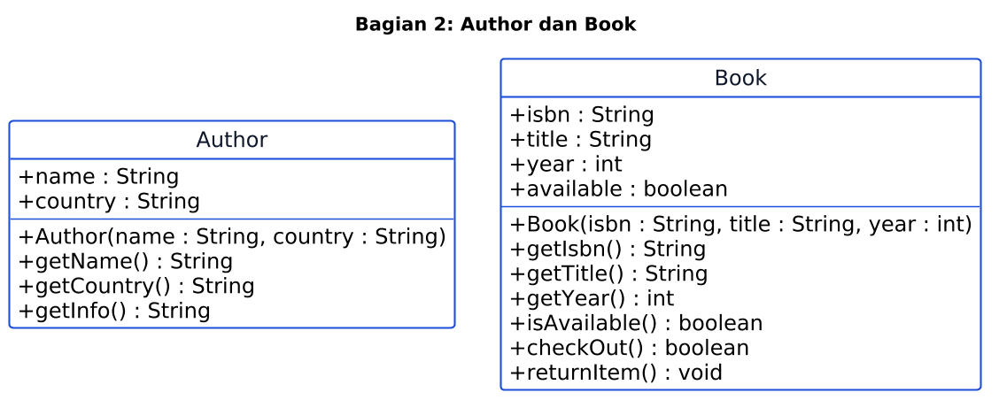
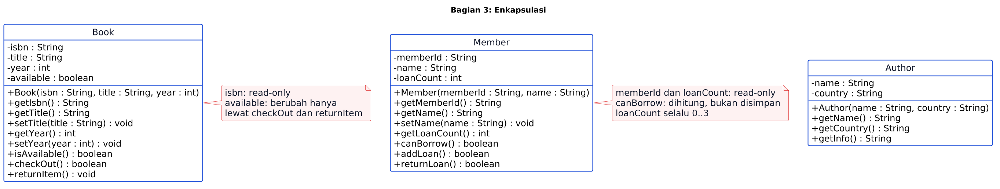
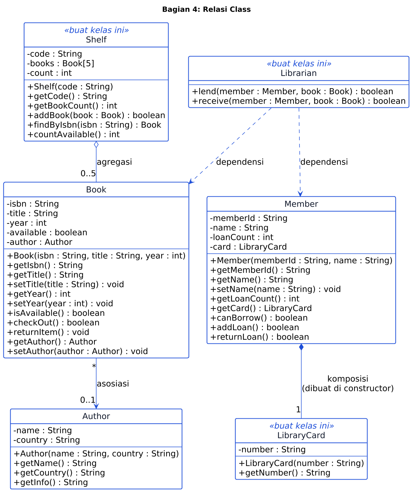
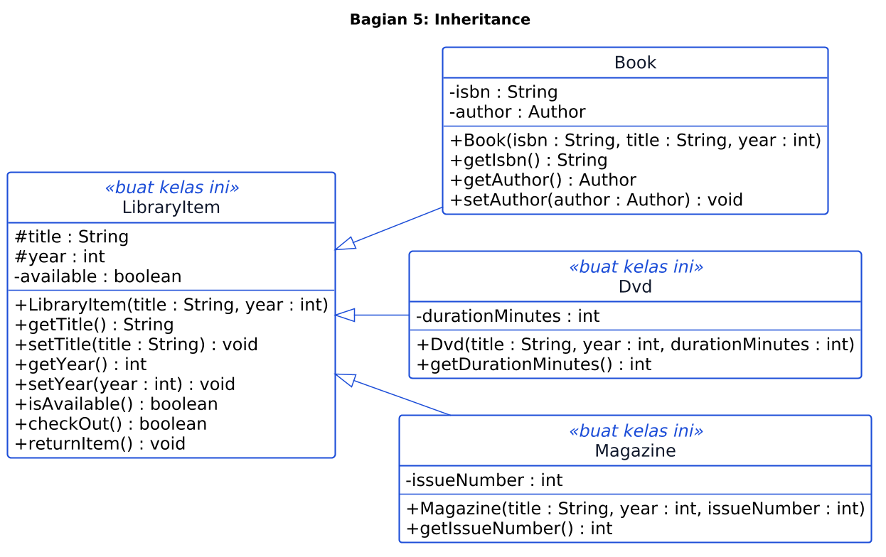
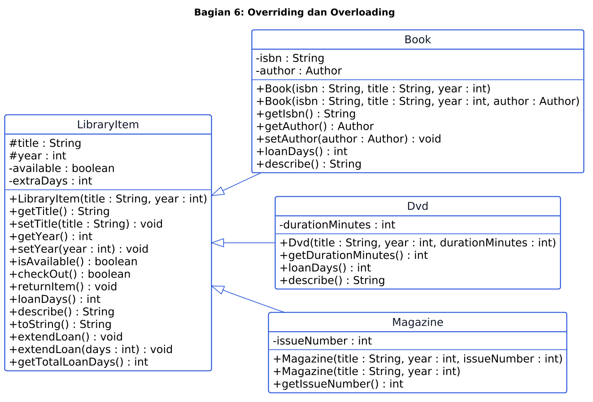
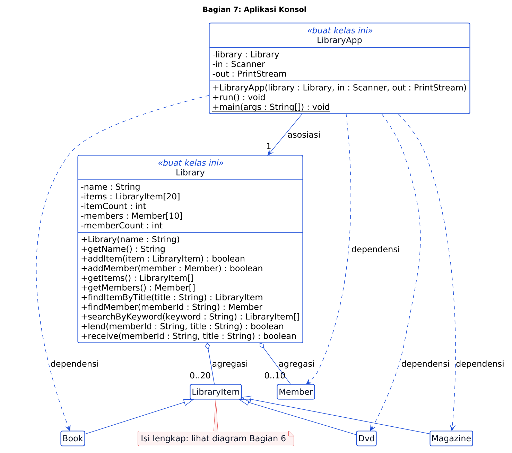

# Latihan OOP: Aplikasi Konsol Perpustakaan (Pertemuan 1 sampai 7)

Dalam latihan ini kamu membangun **aplikasi konsol yang benar-benar berjalan**: sistem perpustakaan dengan menu, data koleksi, anggota, dan peminjaman. Kamu membangunnya sedikit demi sedikit, mengikuti materi Pertemuan 1 sampai 7. Di proyek akhir kamu akan memakai kelas-kelas ini di bawah tampilan GUI.

> **Langkah pertama bukan menulis kode, tetapi memasang WakaTime.** Lanjutkan ke Langkah 0 di bawah.

## Langkah 0: Pasang WakaTime (wajib, sebelum menulis kode apa pun)

WakaTime adalah plugin yang mencatat berapa lama kamu benar-benar mengetik kode. Dosen memakainya untuk melihat **usaha** kamu, bukan hanya hasil akhirnya.

1. Buat akun gratis di [wakatime.com](https://wakatime.com).
2. Buka [wakatime.com/settings/api-key](https://wakatime.com/settings/api-key), lalu salin API key kamu. Jangan bagikan key ini kepada siapa pun.
3. Pasang plugin di editor yang kamu pakai:
   - **NetBeans**: menu `Tools > Plugins`, cari "WakaTime". Jika tidak ketemu, ikuti petunjuk di [wakatime.com/netbeans](https://wakatime.com/netbeans).
   - **VS Code**: pasang ekstensi `WakaTime` (ID: `WakaTime.vscode-wakatime`).
   - **IntelliJ IDEA**: `Settings > Plugins`, cari "WakaTime".
4. Saat plugin meminta, tempel API key kamu.
5. Ketik kode apa saja beberapa menit, lalu buka [wakatime.com/dashboard](https://wakatime.com/dashboard). Pastikan project **oop-library** muncul di sana.

Aturan WakaTime:

- File `.wakatime-project` sudah ada di repositori ini dan berisi `oop-library`. File ini membuat semua mahasiswa memakai nama project yang sama. **Jangan ubah atau hapus.**
- Nyalakan WakaTime **setiap kali** mengerjakan latihan ini. Waktu pengerjaan tanpa plugin tidak tercatat sebagai usaha.
- Screenshot dashboard WakaTime wajib ada di laporan kamu (lihat [Laporan (PDF)](#laporan-pdf)).

Sudah muncul di dashboard? Lanjut ke bagian berikutnya.

## Daftar Isi

1. [Studi Kasus](#studi-kasus)
2. [Peta Materi](#peta-materi)
3. [Memulai](#memulai)
4. [Membuka Proyek](#membuka-proyek)
5. [Cara Membaca Diagram dan Petunjuk](#cara-membaca-diagram-dan-petunjuk)
6. [Bagian 1 sampai 7](#bagian-1-pertemuan-1-pengantar)
7. [Coba Aplikasinya](#coba-aplikasinya)
8. [Laporan (PDF)](#laporan-pdf)
9. [Pengumpulan](#pengumpulan)
10. [Penilaian](#penilaian)
11. [Aturan](#aturan)

## Studi Kasus

Perpustakaan Polinema meminjamkan tiga jenis koleksi:

- **Buku** (dipinjam 14 hari), punya ISBN dan penulis.
- **DVD** (dipinjam 3 hari), punya durasi.
- **Majalah** (dipinjam 7 hari), punya nomor edisi.

Setiap **anggota** punya kartu perpustakaan dan boleh meminjam paling banyak **3** koleksi sekaligus. Petugas memakai aplikasi konsol untuk menambah koleksi, mendaftarkan anggota, meminjamkan, menerima pengembalian, dan mencari koleksi.

Mengapa aplikasi konsol? Aplikasi GUI yang baik dibangun di atas kelas-kelas OOP yang rapi. Latihan ini melatih bagian tersulitnya lebih dulu: merancang kelas, menghubungkannya, dan membuatnya bekerja bersama. Nanti, hanya tampilannya yang kamu ganti.

## Peta Materi

| Bagian | Pertemuan | Konsep | Kelas yang kamu kerjakan |
|---|---|---|---|
| 1 | P1 Pengantar | Cara compile dan run, objek di sekitar kita | `Main` |
| 2 | P2 Class dan Object | class, object, constructor, `this`, method, return value | `Author`, `Book` |
| 3 | P3 Enkapsulasi | `private`, validasi, read-only, derived getter | `Book`, `Author`, `Member` |
| 4 | P4 Relasi Class | asosiasi, agregasi, komposisi, dependensi, array of objects | `Book`, `Member`, `LibraryCard`, `Shelf`, `Librarian` |
| 5 | P6 Inheritance | `extends`, `super(...)`, `protected`, IS-A | `LibraryItem`, `Book`, `Dvd`, `Magazine` |
| 6 | P7 Overriding dan Overloading | `@Override`, `super.method()`, `toString()`, overload method dan constructor | kelas yang sama dengan Bagian 5 |
| 7 | Gabungan P1 sampai P7 | polymorphism dalam array, memisahkan logika dan tampilan | `Library`, `LibraryApp` |

Pertemuan 5 adalah kuis, jadi tidak ada bagian untuknya. Kerjakan **berurutan**: setiap bagian memakai hasil bagian sebelumnya.

## Memulai

Pastikan WakaTime sudah aktif ([Langkah 0](#langkah-0-pasang-wakatime-wajib-sebelum-menulis-kode-apa-pun)).

1. Di halaman GitHub repositori ini, klik **Use this template**, lalu **Create a new repository**.
2. Pilih visibilitas **Private**, lalu ikuti arahan Dosen tentang siapa yang perlu kamu undang.
3. Clone repositori barumu ke komputer.
4. Setiap kali selesai satu bagian, lakukan commit dan push.
5. Buka tab **Actions** di GitHub. Autograder berjalan otomatis setiap kali kamu push, dan menampilkan nilai kodemu.

Untuk menjalankan tes di komputermu sendiri:

```
mvn -q test
```

Untuk menjalankan satu kelas tes saja, contohnya:

```
mvn -q test -Dtest=P02BookTest
```

Di awal, hampir semua tes gagal. Itu normal. Tujuanmu adalah membuat semuanya lulus satu per satu. Baca pesan di tes yang gagal: pesannya menjelaskan apa yang kurang.

## Membuka Proyek

**NetBeans**: `File > Open Project`, pilih folder repositori ini (NetBeans mengenali `pom.xml` sebagai proyek Maven). Untuk menjalankan satu file: klik kanan file, pilih `Run File`, atau tekan `Shift+F6`.

**VS Code**: buka foldernya, pasang "Extension Pack for Java". Tombol `Run` muncul di atas method `main`.

**Tanpa IDE** (command line):

```
mvn -q compile exec:java -Dexec.mainClass=id.ac.polinema.library.Main
```

Ganti `Main` dengan `LibraryApp` untuk menjalankan aplikasi akhir. Kamu butuh JDK 17 atau lebih baru dan Maven.

## Cara Membaca Diagram dan Petunjuk

**Diagram kelas** adalah spesifikasi utama latihan ini. Semua nama kelas, field, constructor, dan method yang kamu butuhkan ada di diagram. Tidak ada file sumber diagram di repositori ini, jadi kamu harus membacanya sendiri dari gambar.

| Simbol | Arti |
|---|---|
| `+` | `public` |
| `-` | `private` |
| `#` | `protected` |
| `nama : Tipe` | field atau parameter bernama `nama` bertipe `Tipe` |
| `metode() : Tipe` | method yang mengembalikan `Tipe` |
| `<<buat kelas ini>>` | kelas belum ada di starter, kamu yang membuatnya |
| garis dengan panah terbuka `-->` | asosiasi |
| garis dengan belah ketupat kosong `o--` | agregasi |
| garis dengan belah ketupat penuh `*--` | komposisi |
| garis putus-putus `..>` | dependensi |
| panah segitiga kosong `<\|--` | inheritance (`extends`) |
| `0..5`, `1`, `*` | multiplicity (jumlah objek) |

Tips: baca per kotak kelas, dari atas ke bawah. Bagian atas adalah field, bagian bawah adalah constructor dan method. Setelah itu baca garis antar kelas.

**Format setiap bagian**:

- **Tujuan**: apa yang harus kamu capai.
- **Aturan yang dicek autograder**: hal yang pasti diuji. Contoh teks di sini hanya contoh bentuk, bukan kode yang bisa disalin.
- **Pertanyaan pemandu**: jawab dulu di kepala atau di kertas sebelum menulis kode.
- **Petunjuk**: klik untuk membuka. Buka hanya setelah kamu mencoba sendiri. Petunjuk menyebut konsep, bukan kode. Di Bagian 4, 6, dan 7 ada **Petunjuk 2** yang menjelaskan langkah per kelas atau method, untuk dibuka hanya jika Petunjuk 1 belum cukup.
- **Telusuri**: latihan menebak, tidak dinilai. Jawabannya masuk laporan.
- **Cek dirimu**: tes mana yang harus lulus.

Di file `.java` yang diberikan, komentar `TODO Petunjuk` berisi pertanyaan atau kata kunci. Hapus komentar itu setelah kamu selesai.

---

## Bagian 1 (Pertemuan 1): Pengantar

**Mengapa ini penting?** Sebelum membuat objek, kamu harus yakin alat kerjamu berfungsi: menulis kode, compile, lalu run.

### Tujuan

Program `Main` berjalan dan mencetak satu baris sapaan.

### Aturan yang dicek autograder

- Baris **pertama** output `Main` adalah persis `Welcome to Polinema Library`.
- Setelah baris itu, kamu bebas menambah baris lain.

### Pertanyaan pemandu

- Apa yang terjadi saat kamu menekan Run: apa yang dikerjakan compiler, dan apa yang dikerjakan JVM?
- Method mana yang pertama kali dijalankan Java, dan mengapa harus `static`?

<details>
<summary>Petunjuk</summary>

- Cek `java -version` di terminal. Kamu butuh versi 17 atau lebih.
- Kelas `System` punya anggota bernama `out`. Cari method-nya yang mencetak satu baris lalu pindah baris.
- Teks yang dicetak harus ditulis sebagai String literal, persis sama.

</details>

### Telusuri

Tidak dinilai, tulis jawabannya di laporan: sebutkan 5 benda di perpustakaan yang menurutmu adalah *objek*. Untuk masing-masing, tulis satu *data* yang dimilikinya dan satu *aksi* yang bisa dilakukannya.

### Cek dirimu

`P01MainOutputTest` lulus.

---

## Bagian 2 (Pertemuan 2): Class dan Object

**Mengapa ini penting?** Class adalah cetakan, object adalah hasil cetakannya. Semua bagian berikutnya memakai class dan object.



### Tujuan

Kelas `Author` dan `Book` bisa dibuat menjadi objek, menyimpan data, dan menjalankan aksi sederhana.

### Aturan yang dicek autograder

- Constructor menyimpan semua parameternya, dan getter mengembalikan nilai yang sama.
- `Author.getInfo()` mengembalikan teks berbentuk `nama (negara)`. Contoh: `Andrea Hirata (Indonesia)`.
- Buku yang baru dibuat **tersedia**.
- `checkOut()` berhasil (`true`) satu kali. Selama buku masih dipinjam, memanggilnya lagi menghasilkan `false`.
- `returnItem()` membuat buku bisa dipinjam lagi.
- Dua objek `Book` tidak saling memengaruhi.
- Di bagian ini field boleh `public` (seperti di diagram). Di Bagian 3 kamu akan menutupnya.

### Pertanyaan pemandu

- Data apa saja yang perlu diingat setiap objek `Book`? Mana yang berasal dari parameter, mana yang diatur sendiri oleh objek?
- Agar objek tahu sedang dipinjam atau tidak, apa yang harus diingatnya?
- Di constructor, nama parameter sama dengan nama field. Bagaimana Java membedakannya?

<details>
<summary>Petunjuk</summary>

- Deklarasikan field di dalam kelas, di luar method. Tipe field bisa dibaca dari diagram.
- Kata kunci `this` menunjuk ke objek yang sedang dikerjakan.
- Status "dipinjam atau tidak" cocok disimpan sebagai tipe `boolean`. Apa nilai awalnya?
- Method yang mengembalikan `boolean` boleh punya dua `return` yang berbeda. Cek kondisi lebih dulu.
- Di `Main`, coba buat dua objek `Book` dan cetak datanya. Ini membantu kamu melihat bahwa objek berdiri sendiri.

</details>

### Telusuri

Tidak dinilai: perhatikan kode ini, lalu tebak outputnya.

```java
Book a = new Book("1", "Clean Code", 2008);
Book b = a;
b.checkOut();
System.out.println(a.isAvailable());
Book c = new Book("2", "Refactoring", 1999);
System.out.println(c.isAvailable());
```

Mengapa hasil baris pertama dan kedua berbeda? Gambar `a`, `b`, dan `c` di stack, dan objeknya di heap.

### Cek dirimu

`P02AuthorTest` dan `P02BookTest` lulus.

---

## Bagian 3 (Pertemuan 3): Enkapsulasi

**Mengapa ini penting?** Kalau field `public`, siapa pun bisa mengisi `year = -5` atau `title = ""`. Enkapsulasi membuat objek menjaga datanya sendiri.



### Tujuan

Objek menjaga datanya sendiri: data tidak bisa diubah sembarangan dan tidak pernah berada dalam keadaan tidak valid.

### Aturan yang dicek autograder

Semua kelas:

- Semua field `private`. Bandingkan diagram Bagian 3 dengan Bagian 2.

`Book`:

- Judul `null`, kosong, atau hanya spasi **ditolak**. Tahun 0 atau negatif **ditolak**.
- Penolakan berarti `IllegalArgumentException` dilempar dan nilai lama **tetap**.
- Constructor juga menolak data tidak valid. `isbn` tidak boleh kosong.
- `isbn` read-only (tanpa setter). Status tersedia tidak punya setter dan hanya berubah lewat `checkOut()` dan `returnItem()`.

`Member` (kelas ini kamu isi dari stub sesuai diagram):

- `memberId` dan `loanCount` read-only (tanpa setter). `memberId` dan nama tidak boleh kosong.
- `setName` menolak nama kosong dan menjaga nama lama.
- Jumlah pinjaman selalu antara 0 dan 3. `addLoan()` dan `returnLoan()` mengembalikan `true` jika berhasil dan `false` jika sudah di batas.
- `canBorrow()` menjawab apakah anggota masih boleh meminjam.

### Pertanyaan pemandu

- Jika `Member` punya `public int loanCount`, baris kode apa yang merusak aturan "maksimal 3"? Bagaimana `private` mencegahnya?
- Constructor dan setter punya aturan validasi yang sama. Bagaimana menghindari menulis aturannya dua kali?
- Apakah `canBorrow()` perlu field sendiri? Apa yang terjadi jika datanya tidak sinkron dengan `loanCount`?
- Mengapa `memberId` tidak boleh punya setter?

<details>
<summary>Petunjuk</summary>

- Ubah modifier field, lalu lihat apa yang error di `Main` kamu. Itu pelajaran enkapsulasinya.
- Urutan aman di setter: **periksa dulu**, baru isi field. Kalau tidak valid, hentikan sebelum field disentuh.
- Untuk menolak data, ingat kata kunci `throw` dan tipe exception yang disebut di atas.
- Constructor boleh memanggil setter milik kelasnya sendiri.
- Untuk teks kosong, class `String` punya method yang menjawab apakah teks kosong atau hanya spasi.
- `canBorrow()` bisa dihitung langsung dari `loanCount` setiap kali dipanggil.

</details>

### Telusuri

Tidak dinilai: tulis satu baris kode di `Main` yang akan merusak aturan "maksimal 3 pinjaman" jika field `loanCount` `public`. Mengapa baris itu tidak bisa dikompilasi setelah field menjadi `private`?

### Cek dirimu

`P03EncapsulationTest` dan `P03MemberTest` lulus. Tes Bagian 2 harus tetap lulus.

---

## Bagian 4 (Pertemuan 4): Relasi Class

**Mengapa ini penting?** Objek jarang bekerja sendirian. Memilih relasi yang tepat menentukan siapa memiliki siapa, dan siapa yang ikut hilang ketika objek lain hilang.



### Tujuan

Menghubungkan kelas sesuai relasi di diagram: asosiasi, agregasi, komposisi, dan dependensi.

### Aturan yang dicek autograder

`Book` dan `Author` (asosiasi):

- Buku baru belum punya penulis. `getAuthor()` mengembalikan objek `Author` **yang sama** dengan yang diberikan ke `setAuthor`, dan dua buku boleh berbagi satu `Author`.

`Member` dan `LibraryCard` (komposisi):

- Setiap `Member` punya kartu dengan nomor berbentuk `CARD-` diikuti `memberId`. Contoh: `CARD-M001`.
- Kartu **tidak** diberikan dari luar. `Member` tidak punya constructor yang menerima `LibraryCard`. Dua anggota punya dua kartu berbeda.

`Shelf` (agregasi):

- Kapasitas rak **5** buku. `addBook` mengembalikan `false` jika rak penuh atau bukunya `null`.
- `findByIsbn` mengembalikan objek `Book` yang sama (bukan salinan), atau `null` jika tidak ada.
- `countAvailable` menghitung buku yang saat ini tersedia.

`Librarian` (dependensi):

- Tidak punya field sama sekali.
- `lend(member, book)` berhasil hanya jika anggota boleh meminjam **dan** buku tersedia. Jika berhasil, buku dipinjam dan pinjaman anggota bertambah. Jika gagal, tidak ada yang berubah.
- `receive(member, book)` berhasil hanya jika buku sedang dipinjam dan anggota punya pinjaman. Jika berhasil, buku tersedia lagi dan pinjaman anggota berkurang.

### Pertanyaan pemandu

Jawab untuk **setiap** garis relasi di diagram:

- Siapa yang **membuat** objek di ujung garis: kelas ini sendiri, atau kode di luarnya?
- Jika pemilik objek dibuang, apakah objek di ujung garis ikut hilang?
- Apakah objek di ujung garis perlu disimpan sebagai **field**, atau cukup muncul sebagai **parameter** method?
- Apa arti `0..5` dan `0..1` pada garis tersebut?

<details>
<summary>Petunjuk 1</summary>

- Relasi yang disimpan sebagai field berarti kelas **mengingat** objek itu. Relasi dependensi tidak mengingat apa pun.
- Pada komposisi, field diisi **di dalam constructor**, bukan dari parameter constructor.
- Array di Java punya ukuran tetap. Kamu butuh satu variabel lagi untuk tahu berapa slot yang sudah terisi.
- `findByIsbn`: telusuri hanya slot yang terisi. Bandingkan teks dengan `equals`, bukan `==`.
- `Librarian`: method milik `Member` dan `Book` yang sudah ada sudah menjawab sebagian besar pertanyaanmu. Panggil, jangan tulis ulang aturannya.
- Urutan pemeriksaan di `lend` penting. Apa yang terjadi jika kamu meminjam bukunya dulu, baru sadar anggotanya sudah mencapai batas?

</details>

<details>
<summary>Petunjuk 2 (langkah per kelas, buka jika Petunjuk 1 belum cukup)</summary>

- **`Book` dan `Author` (asosiasi)**: (1) tambahkan field bertipe `Author` di `Book`, `private`. Tidak ada yang mengisinya di constructor, jadi nilai awalnya `null`. (2) `getAuthor` mengembalikan field itu. (3) `setAuthor` hanya **menyimpan referensi** yang diterima. Jangan membuat `Author` baru di dalamnya, supaya dua buku bisa menunjuk ke objek yang sama.
- **`LibraryCard`**: satu field `private` untuk nomor. Constructor menyimpannya, dan `getNumber` mengembalikannya.
- **`Member` (komposisi)**: (1) tambahkan field bertipe `LibraryCard`. (2) Di constructor `Member`, setelah semua validasi lolos, buat objek `LibraryCard` dengan `new` dan simpan di field. Nomornya dibentuk dari teks `CARD-` yang digabung dengan `memberId`. (3) `getCard` mengembalikan field. Jangan menambahkan parameter kartu ke constructor, dan jangan membuat kartu baru setiap `getCard` dipanggil.
- **`Shelf`**: (1) field: kode rak, array `Book` berukuran 5, dan penghitung jumlah buku terisi dengan nilai awal 0. (2) `addBook`: jika bukunya `null` atau penghitung sudah sama dengan panjang array, kembalikan `false`. Jika tidak, simpan buku di slot yang ditunjuk penghitung, naikkan penghitung, dan kembalikan `true`. (3) `getBookCount` mengembalikan penghitung. (4) `findByIsbn`: ulangi dari slot 0 sampai sebelum penghitung. Jika ISBN buku di slot itu sama dengan yang dicari (pakai `equals`), kembalikan buku itu. Jika perulangan selesai, kembalikan `null`. (5) `countAvailable`: ulangi dengan batas yang sama. Setiap buku yang tersedia menambah satu ke hitungan.
- **`Librarian` (dependensi)**: tanpa field dan tanpa constructor khusus. Method-nya menerima `Member` dan `Book` sebagai parameter dan tidak menyimpannya.
  - `lend`: (1) jika anggota tidak boleh meminjam, kembalikan `false`. (2) Pinjam bukunya. Jika gagal, kembalikan `false`. (3) Tambah pinjaman anggota, lalu kembalikan `true`. Cek anggota **sebelum** mengubah buku.
  - `receive`: (1) jika buku tidak sedang dipinjam, kembalikan `false`. (2) Kurangi pinjaman anggota. Jika gagal (tidak punya pinjaman), kembalikan `false`. (3) Kembalikan bukunya, lalu kembalikan `true`.

</details>

### Telusuri

Tidak dinilai: jika objek `Member` dibuang, apa yang terjadi pada `LibraryCard`-nya? Jika objek `Shelf` dibuang, apa yang terjadi pada `Book` di dalamnya? Jelaskan perbedaan keduanya dengan kata-katamu sendiri.

### Cek dirimu

`P04AssociationTest`, `P04ShelfAggregationTest`, `P04MemberCardCompositionTest`, dan `P04LibrarianDependencyTest` lulus.

---

## Bagian 5 (Pertemuan 6): Inheritance

**Mengapa ini penting?** Perpustakaan tidak hanya punya buku. Kalau `Dvd` dan `Magazine` menyalin kode `Book`, setiap perbaikan harus dilakukan tiga kali. Inheritance membuat kode yang sama cukup ditulis sekali.



### Tujuan

Merapikan kode: bagian yang sama antara `Book`, `Dvd`, dan `Magazine` hidup di satu tempat, yaitu `LibraryItem`. Ini adalah **refactoring**: semua tes lama harus **tetap lulus**.

### Aturan yang dicek autograder

- `Book`, `Dvd`, dan `Magazine` adalah subclass langsung dari `LibraryItem`.
- `LibraryItem` memvalidasi `title` dan `year` seperti `Book` di Bagian 3. Field `title` dan `year` bersifat `protected`, dan tidak ada field `public`.
- `Book` tidak lagi menyimpan `title`, `year`, dan status tersedia sendiri, dan tidak menulis ulang method yang sama dengan `LibraryItem`.
- `Dvd` dan `Magazine` menyimpan data khususnya sesuai diagram (`private`). Getter judul dan tahun serta `checkOut`/`returnItem` dipakai dari `LibraryItem`.
- Validasi setter ikut berlaku di semua subclass.
- Semua tes Bagian 2 sampai 4 masih lulus.

### Pertanyaan pemandu

- Bandingkan `Book` di diagram Bagian 4 dengan `Dvd` di diagram Bagian 5. Apa yang **sama** di keduanya? Apa yang **khusus**?
- Kalimat "`Dvd` adalah sebuah `LibraryItem`" masuk akal. Apakah "`Library` adalah sebuah `Book`" juga masuk akal?
- Mengapa `title` dan `year` ditandai `#` dan bukan `-`?
- Jika `LibraryItem` punya constructor yang meminta `title` dan `year`, siapa yang harus mengisinya saat sebuah `Dvd` dibuat?

<details>
<summary>Petunjuk</summary>

- Kata kunci `extends` menyatakan hubungan IS-A.
- Constructor tidak diwariskan. Subclass memanggil constructor parent dengan `super(...)`, dan harus menjadi **baris pertama**.
- `protected` bisa diakses subclass, tetapi tidak oleh kelas lain di luar paket dan keluarga.
- Kerjakan bertahap: buat `LibraryItem`, pindahkan satu bagian, jalankan tes, ulangi. Jangan memindahkan semuanya sekaligus.
- Jika tes lama merah setelah memindahkan sesuatu, sebuah method atau constructor kemungkinan hilang atau berubah.

</details>

### Telusuri

Tidak dinilai: apa yang diwarisi `Dvd` dari `LibraryItem`, dan apa yang tidak? Mengapa constructor `LibraryItem` tidak ikut diwariskan, tetapi tetap harus dipanggil saat `Dvd` dibuat?

### Cek dirimu

`P06InheritanceTest` lulus, dan tes Bagian 2 sampai 4 tidak ada yang rusak.

---

## Bagian 6 (Pertemuan 7): Overriding dan Overloading

**Mengapa ini penting?** Subclass sering perlu perilaku sendiri. Buku dipinjam 14 hari, DVD hanya 3 hari. Overriding mengganti perilaku turunan, overloading menyediakan beberapa cara memanggil method atau constructor yang sama.



### Tujuan

Subclass mengganti perilaku yang diwarisi (overriding), dan satu nama method atau constructor bisa dipanggil dengan beberapa bentuk parameter (overloading).

### Aturan yang dicek autograder

Method baru di `LibraryItem` (baca daftarnya di diagram):

- `loanDays()` mengembalikan **7**.
- `describe()` mengembalikan deskripsi singkat, dan `toString()` mengembalikan hasil yang sama dengan `describe()`.
- `extendLoan()` menambah perpanjangan **7** hari. `extendLoan(int days)` menambah sebanyak `days`, dan menolak 0 atau negatif dengan `IllegalArgumentException`.
- `getTotalLoanDays()` adalah lama pinjam ditambah semua perpanjangan.

Nilai yang diharapkan:

| Objek | `loanDays()` | `describe()` |
|---|---|---|
| `LibraryItem("Generic", 2000)` | 7 | `Generic (2000)` |
| `Book` tanpa penulis | 14 | `Clean Code (2008) by Unknown` |
| `Book` dengan penulis Robert Martin | 14 | `Clean Code (2008) by Robert Martin` |
| `Dvd("Inception", 2010, 148)` | 3 | `Inception (2010) [148 min]` |
| `Magazine("Tempo", 2024, 7)` | 7 | `Tempo (2024)` |

Constructor baru (lihat diagram):

- `Book(isbn, title, year, author)` langsung mengisi penulis.
- `Magazine(title, year)` memberi nomor edisi **1**. Versi 3 parameter tetap berfungsi.

Struktur:

- `Book` dan `Dvd` meng-override `loanDays()`. `Magazine` **tidak** meng-override-nya.

### Pertanyaan pemandu

- Bandingkan `describe()` milik `Book` dan milik `LibraryItem`. Bagian mana yang sudah dikerjakan parent? Perlukah kamu menulisnya ulang?
- `Magazine` tidak perlu `loanDays()` sendiri. Mengapa? Versi siapa yang berjalan?
- `extendLoan()` dan `extendLoan(int)` sama-sama bernama `extendLoan`. Apa yang membedakannya bagi compiler? Bisakah salah satu memakai yang lain?
- Dua constructor `Book` hampir sama. Bagaimana menghindari menyalin isinya?

<details>
<summary>Petunjuk 1</summary>

- Anotasi `@Override` membuat compiler menolak jika nama atau parameter salah. Pasang pada setiap override.
- Kata kunci `super` bisa dipakai bukan hanya untuk constructor, tetapi juga untuk memanggil method milik parent.
- Constructor boleh memanggil constructor lain di kelas yang **sama**, dengan kata kunci yang berbeda dari `super(...)`. Pemanggilan ini juga harus berada di baris pertama.
- `toString()` sudah ada di `Object`. Kamu meng-override-nya.
- Teks `Unknown` hanya dipakai jika `author` bernilai `null`.
- Perpanjangan perlu diingat di sebuah field di `LibraryItem`. Bagaimana `getTotalLoanDays()` memakainya agar tetap benar untuk `Book` (14) dan `Dvd` (3)?

</details>

<details>
<summary>Petunjuk 2 (langkah per kelas, buka jika Petunjuk 1 belum cukup)</summary>

- **`LibraryItem`**:
  - `loanDays()` mengembalikan 7.
  - `describe()` menyusun teks dari `title`, sebuah spasi, lalu `year` di dalam tanda kurung (hasil seperti `Generic (2000)`).
  - `toString()` cukup memanggil `describe()`. Tidak perlu menyusun teks lagi.
  - Tambahkan field `private` untuk total hari perpanjangan, nilai awal 0.
  - `extendLoan(int days)`: jika `days` 0 atau negatif, lempar `IllegalArgumentException`. Jika tidak, tambahkan ke field perpanjangan.
  - `extendLoan()` tidak perlu mengulang isi di atas. Cukup panggil `extendLoan(int)` dengan angka 7.
  - `getTotalLoanDays()` menjumlahkan **hasil pemanggilan `loanDays()`** dan field perpanjangan. Jangan menulis angka 7 langsung. Dengan memanggil method, `Book` otomatis memakai 14 dan `Dvd` memakai 3 (inilah polymorphism).
- **`Book`**:
  - `loanDays()` mengembalikan 14.
  - `describe()`: (1) ambil hasil `describe()` milik parent dengan `super`. (2) Tentukan nama penulis: `Unknown` jika `author` `null`, selain itu nama dari objek `Author`. (3) Gabungkan hasil parent, teks ` by ` (dengan spasi di kiri dan kanan), dan nama penulis.
  - Constructor 4 parameter: baris pertamanya memanggil constructor 3 parameter milik `Book` sendiri (kata kunci `this` diikuti kurung). Setelah itu baru isi penulisnya.
- **`Dvd`**: `loanDays()` mengembalikan 3. `describe()` mengambil hasil parent, lalu menambahkan spasi, tanda kurung siku berisi durasi dan teks `min` (hasil seperti `Inception (2010) [148 min]`).
- **`Magazine`**: tidak ada override sama sekali. Constructor 2 parameter: baris pertamanya memanggil constructor 3 parameter milik `Magazine` sendiri dengan nomor edisi 1.
- Cara memeriksa tanpa tes: di `Main`, taruh `Book`, `Dvd`, dan `Magazine` dalam satu array `LibraryItem[]`, cetak `loanDays()` dan `describe()` setiap elemen, lalu bandingkan dengan tabel nilai yang diharapkan.

</details>

### Telusuri

Tidak dinilai: di `Main`, buat array bertipe `LibraryItem[]` berisi satu `Book`, satu `Dvd`, dan satu `Magazine`, lalu cetak `loanDays()` dan `describe()` masing-masing dengan satu perulangan. Variabelnya bertipe `LibraryItem`, tetapi hasilnya `14`, `3`, dan `7`, bukan `7` untuk semuanya. Siapa yang menentukan versi method mana yang berjalan: tipe variabel atau objeknya?

### Cek dirimu

`P07OverrideTest` dan `P07OverloadTest` lulus.

---

## Bagian 7 (Gabungan P1 sampai P7): Aplikasi Konsol

**Mengapa ini penting?** Sekarang semua kelas dirangkai menjadi aplikasi utuh. Kuncinya adalah memisahkan **logika** dari **tampilan**.



### Tujuan

Membuat aplikasi konsol dengan menu yang bisa menambah koleksi, mendaftarkan anggota, meminjam, mengembalikan, dan mencari. `Library` berisi logika. `LibraryApp` berisi tampilan.

### Pertanyaan pemandu

- `Library` tidak boleh mencetak apa pun. Mengapa? Apa yang kamu ganti di proyek akhir saat tampilannya menjadi GUI, dan apa yang tidak perlu disentuh?
- Array `items` berisi `Book`, `Dvd`, dan `Magazine` sekaligus. Mengapa itu diizinkan? Konsep apa namanya?
- Mengapa `LibraryApp` menerima `Scanner` dan `PrintStream` lewat constructor, bukan langsung memakai `System.in` dan `System.out`?
- Pada alur "pinjam": objek mana yang dipanggil, dan method apa yang berjalan di masing-masingnya?

### Aturan yang dicek autograder: kelas `Library`

Buat kelas `Library` sesuai diagram. Tidak boleh ada `System.out` di dalamnya.

| Method | Aturan |
|---|---|
| `addItem` | `false` jika `null` atau array penuh (20 item). |
| `addMember` | `false` jika `null`, penuh (10 anggota), atau `memberId` sudah terdaftar. |
| `getItems`, `getMembers` | Array baru yang **hanya berisi elemen terisi**. |
| `findItemByTitle` | Judul dicocokkan **tanpa peduli huruf besar-kecil**. `null` jika tidak ada. |
| `findMember` | Berdasarkan `memberId`. `null` jika tidak ada. |
| `searchByKeyword` | Semua koleksi yang judulnya **memuat** kata kunci (tanpa peduli huruf besar-kecil). Jika tidak ada, kembalikan array **kosong**, bukan `null`. |
| `lend(memberId, title)` | `true` hanya jika anggota ada, koleksi ada, anggota boleh meminjam, dan koleksi tersedia. Setelah itu koleksi dipinjam dan pinjaman anggota bertambah. |
| `receive(memberId, title)` | `true` hanya jika anggota dan koleksi ada, koleksi sedang dipinjam, dan anggota punya pinjaman. Setelah itu koleksi tersedia lagi dan pinjaman anggota berkurang. |

Catatan: latihan ini belum mencatat siapa meminjam apa. Itu sengaja, supaya kamu fokus pada kerja sama antar kelas.

<details>
<summary>Petunjuk 1: Library</summary>

- Dua array (`items` dan `members`) masing-masing perlu penghitung isi, seperti di `Shelf`.
- Tipe elemen array koleksi adalah `LibraryItem`. Itu sebabnya `Book`, `Dvd`, dan `Magazine` bisa masuk bersama.
- Untuk memotong array menjadi hanya bagian yang terisi, pelajari `java.util.Arrays.copyOf`. Memakai `Arrays` untuk array biasa tetap sesuai aturan (bukan koleksi).
- Untuk mengabaikan huruf besar-kecil, `String` punya method khusus perbandingan dan method untuk mengubah huruf.
- `lend` dan `receive` cukup memanggil method yang sudah ada di `Member` dan `LibraryItem`. Tulis alurnya: cari, periksa, ubah.
- Hasil `searchByKeyword` panjangnya belum diketahui sebelum menghitung. Pikirkan cara menampungnya dulu.

</details>

<details>
<summary>Petunjuk 2: Library (langkah per method, buka jika Petunjuk 1 belum cukup)</summary>

Field yang dibutuhkan: nama, array koleksi berukuran 20 dan penghitungnya, array anggota berukuran 10 dan penghitungnya. Nilai awal kedua penghitung adalah 0.

- **`addItem`**: (1) jika item `null` atau penghitung sudah sama dengan panjang array, kembalikan `false`. (2) Simpan item di slot yang ditunjuk penghitung. (3) Naikkan penghitung. (4) Kembalikan `true`.
- **`addMember`**: sama dengan `addItem`, ditambah satu pemeriksaan: panggil `findMember` dengan `memberId` anggota itu. Jika hasilnya bukan `null`, id sudah terdaftar.
- **`getItems`** dan **`getMembers`**: salin array dari indeks 0 sampai sebelum penghitung ke array baru. `Arrays.copyOf(array, panjangBaru)` melakukannya.
- **`findItemByTitle`** dan **`findMember`**: gunakan perulangan dari 0 sampai sebelum penghitung (bukan sampai panjang array, karena sisanya `null`). Jika ada yang cocok, langsung kembalikan. Jika perulangan selesai, kembalikan `null`. Untuk judul, cari method `String` yang membandingkan tanpa peduli huruf besar-kecil.
- **`searchByKeyword`**: (1) buat array sementara sepanjang jumlah koleksi. (2) Telusuri koleksi. Ubah judul dan kata kunci ke huruf kecil, lalu periksa apakah judul memuat kata kunci. Jika ya, simpan di array sementara dan naikkan penghitung hasil. (3) Salin array sementara sepanjang penghitung hasil. Tanpa hasil, kamu otomatis mendapat array kosong.
- **`lend`**: (1) cari anggota dan koleksi. (2) Jika salah satunya `null`, kembalikan `false`. (3) Jika anggota tidak boleh meminjam, kembalikan `false`. (4) Pinjam koleksinya. Jika gagal, kembalikan `false`. (5) Tambah pinjaman anggota, lalu kembalikan `true`. Perhatikan urutan 3 dan 4: koleksi baru boleh diubah setelah anggota dipastikan boleh meminjam.
- **`receive`**: (1) cari anggota dan koleksi, `null` berarti `false`. (2) Jika koleksi tidak sedang dipinjam, kembalikan `false`. (3) Kurangi pinjaman anggota. Jika gagal (tidak punya pinjaman), kembalikan `false`. (4) Kembalikan koleksinya, lalu kembalikan `true`.

</details>

### Kelas `LibraryApp`

Buat file `LibraryApp.java`. Di bawah ini adalah **kerangka**. Konstruktornya sudah lengkap. Semua method lain berisi petunjuk di komentar `TODO`. Salin, lalu tulis isi setiap method. Hapus komentar `TODO` setelah selesai.

```java
package id.ac.polinema.library;

import java.io.PrintStream;
import java.util.Scanner;

public class LibraryApp {

    private Library library;
    private Scanner in;
    private PrintStream out;

    public LibraryApp(Library library, Scanner in, PrintStream out) {
        this.library = library;
        this.in = in;
        this.out = out;
    }

    public void run() {
        // TODO Petunjuk:
        // - Menu diulang terus sampai pengguna memilih 0. Struktur perulangan apa yang cocok?
        // - Pilihan menu dibaca sebagai String, lalu dipetakan ke method di bawah. Apa
        //   struktur percabangan yang cocok untuk satu nilai dengan banyak kemungkinan?
        // - Cetak "Goodbye" saat keluar, dan "Invalid choice" untuk pilihan yang tidak dikenal.
        // - Apa yang terjadi jika input habis (hasNextLine() bernilai false)? Jangan sampai crash.
    }

    private void printMenu() {
        // TODO Petunjuk: cetak judul dan 10 baris menu persis seperti tabel "Teks yang harus dicetak".
        // Judul memakai nama perpustakaan dari Library.
    }

    private String readLine(String prompt) {
        // TODO Petunjuk: cetak prompt TANPA pindah baris, lalu baca satu baris. Buang spasi di
        // ujung teks. Jika input sudah habis, kembalikan teks kosong.
        return "";
    }

    private int readInt(String prompt) {
        // TODO Petunjuk: pakai readLine. Kembalikan angka jika teksnya bilangan bulat positif,
        // dan -1 jika bukan. Tanpa try-catch: periksa dulu setiap karakternya. Tipe `Character`
        // punya method untuk memeriksa angka.
        return -1;
    }

    private void showItems() {
        // TODO Petunjuk: minta array koleksi dari library. Satu baris per koleksi. Bagaimana jika kosong?
        // Method mana yang menjawab deskripsi dan lama pinjam, dan apakah kamu perlu tahu jenis koleksinya?
    }

    private void addBook() {
        // TODO Petunjuk: baca isian dalam urutan di tabel. Periksa input SEBELUM membuat objek,
        // supaya constructor tidak melempar exception. Data penulis hanya ditanya jika
        // nama penulis tidak kosong.
    }

    private void addDvd() {
        // TODO Petunjuk: mirip addBook, tetapi lebih pendek. Apa yang bisa dipakai ulang?
    }

    private void addMagazine() {
        // TODO Petunjuk: mirip addDvd. Perhatikan: hasil addItem bisa true atau false.
    }

    private void registerMember() {
        // TODO Petunjuk: baca id dan nama, periksa tidak kosong, lalu serahkan ke library.
        // Cetak pesan sesuai hasil addMember.
    }

    private void lendItem() {
        // TODO Petunjuk: baca id dan judul, lalu serahkan keputusan ke library. LibraryApp
        // tidak memeriksa aturan peminjaman sendiri. Hanya mencetak hasilnya.
    }

    private void returnItem() {
        // TODO Petunjuk: mirip lendItem.
    }

    private void searchItems() {
        // TODO Petunjuk: baca kata kunci, minta hasil dari library, cetak dengan format yang sama
        // seperti showItems. Bagaimana jika hasilnya kosong?
    }

    private void showMembers() {
        // TODO Petunjuk: satu baris per anggota. Bagaimana jika kosong?
    }

    public static void main(String[] args) {
        // TODO Petunjuk: buat Library bernama "Polinema Library", isi beberapa data contoh
        // (buku dengan penulis, DVD, majalah, satu anggota), lalu jalankan LibraryApp dengan
        // keyboard dan layar sungguhan.
    }
}
```

Perhatikan bahwa `LibraryApp` tidak memakai `System.in` dan `System.out` langsung. Itu yang membuat autograder bisa "mengetik" menu untuk aplikasimu.

<details>
<summary>Petunjuk 2: LibraryApp (langkah per method, buka jika komentar TODO belum cukup)</summary>

Gunakan `out` untuk mencetak dan `in` untuk membaca, bukan `System.out` dan `System.in`.

- **`run`**: (1) buat variabel penanda yang menyatakan program masih berjalan. (2) Ulangi selama penanda itu benar. Di setiap putaran: cetak menu, lalu jika tidak ada baris input lagi hentikan perulangan. (3) Baca satu baris dan buang spasi di ujungnya. (4) Pilih aksi dengan `switch` pada teks tersebut: `"1"` sampai `"9"` memanggil method yang sesuai, `"0"` mencetak `Goodbye` dan mematikan penanda, dan `default` mencetak `Invalid choice`.
- **`printMenu`**: satu `println` untuk judul (`=== ` + nama perpustakaan + ` ===`), sepuluh `println` untuk baris menu, lalu satu `print` (tanpa `ln`) untuk `Choose: `. Nama perpustakaan diminta dari `library`.
- **`readLine`**: (1) `print` promptnya. (2) Jika `in` masih punya baris berikutnya, baca dan buang spasi ujungnya. (3) Jika tidak, kembalikan teks kosong.
- **`readInt`**: (1) panggil `readLine`. (2) Jika teksnya kosong, kembalikan -1. (3) Telusuri setiap karakter. Jika ada yang bukan angka, kembalikan -1. (4) Ubah teks menjadi bilangan dengan method milik tipe pembungkus `Integer`. (5) Jika hasilnya 0, kembalikan -1 (karena yang diterima hanya bilangan positif). Teks yang sangat panjang bisa melebihi batas `int`, jadi batasi panjang teks (misalnya 9 digit) sebelum diubah.
- **`showItems`**: (1) ambil array dari `library`. (2) Jika panjangnya 0, cetak `No items`. (3) Jika tidak, telusuri dan cetak satu baris per koleksi. Susun barisnya dari tiga bagian: hasil `describe()`, status (cek `isAvailable()` untuk memilih `Available` atau `Borrowed`), dan `loanDays()` diikuti ` days`, dipisahkan ` | `. Karena baris ini juga dipakai `searchItems`, pertimbangkan menaruhnya di satu method bantu.
- **`addBook`**: (1) baca `ISBN`, `Title`, lalu `Year` dengan `readInt`. (2) Jika tahun -1, cetak `Invalid number` dan hentikan method. (3) Jika `ISBN` atau judul kosong, cetak `Invalid input` dan hentikan. (4) Buat objek `Book`. (5) Baca nama penulis. Jika tidak kosong, baca negara, buat `Author`, lalu pasang ke buku. (6) Serahkan buku ke `library` dan cetak `Item added` atau `Library is full` sesuai hasilnya.
- **`addDvd`** dan **`addMagazine`**: pola yang sama, tanpa langkah penulis. Pesan hasilnya sama dengan `addBook`, sehingga bisa dipakai bersama lewat method bantu yang menerima hasil `addItem`.
- **`registerMember`**: (1) baca id dan nama. (2) Jika salah satunya kosong, cetak `Invalid input` dan hentikan. (3) Buat `Member`. (4) Cetak `Member registered` atau `Member ID already exists` sesuai hasil `addMember`.
- **`lendItem`** dan **`returnItem`**: baca id dan judul, panggil method yang sesuai di `library`, lalu pilih salah satu dari dua pesan berdasarkan hasilnya. Tidak ada aturan peminjaman di sini.
- **`searchItems`**: baca kata kunci, minta hasil dari `library`, cetak `No items found` jika kosong, dan jika tidak cetak setiap hasil dengan format yang sama seperti `showItems`.
- **`showMembers`**: minta array anggota. Jika kosong cetak `No members`. Jika tidak, cetak satu baris per anggota dengan bentuk `id - nama (N loans)`.
- **`main`**: (1) buat `Library`. (2) Buat beberapa objek (`Book` yang sudah punya penulis, `Dvd`, `Magazine`, `Member`) dan tambahkan ke `library`. (3) Buat `LibraryApp` dengan `new Scanner(System.in)` dan `System.out`, lalu panggil `run()`.

</details>

### Teks yang harus dicetak

Autograder membandingkan output, jadi tulis **persis** seperti tabel ini. Setiap pesan dicetak dengan `println`. Prompt dicetak dengan `print` (tanpa pindah baris).

| Menu | Prompt (berurutan) | Hasil |
|---|---|---|
| (tiap putaran) | Judul `=== <nama perpustakaan> ===`, lalu baris `1. List items`, `2. Add book`, `3. Add DVD`, `4. Add magazine`, `5. Register member`, `6. Lend item`, `7. Return item`, `8. Search items`, `9. List members`, `0. Exit`, lalu prompt `Choose: ` | menu tampil lagi setelah setiap aksi |
| 1 List items | tidak ada | Satu baris per koleksi: `describe() \| status \| N days`. Status: `Available` atau `Borrowed`. N = `loanDays()`. Jika kosong: `No items`. |
| 2 Add book | `ISBN: `, `Title: `, `Year: `, `Author name (blank for none): `, lalu `Author country: ` hanya jika nama penulis tidak kosong | `Item added`, atau `Library is full` |
| 3 Add DVD | `Title: `, `Year: `, `Duration (minutes): ` | `Item added`, atau `Library is full` |
| 4 Add magazine | `Title: `, `Year: `, `Issue number: ` | `Item added`, atau `Library is full` |
| 5 Register member | `Member ID: `, `Name: ` | `Member registered`, atau `Member ID already exists` |
| 6 Lend item | `Member ID: `, `Title: ` | `Loan successful`, atau `Loan failed` |
| 7 Return item | `Member ID: `, `Title: ` | `Return successful`, atau `Return failed` |
| 8 Search items | `Keyword: ` | Satu baris per hasil (format sama dengan menu 1). Jika tidak ada: `No items found` |
| 9 List members | tidak ada | Satu baris per anggota: `M001 - Budi (1 loans)`. Jika kosong: `No members` |
| 0 Exit | tidak ada | `Goodbye`, lalu program selesai |
| lainnya | tidak ada | `Invalid choice` |

Aturan input untuk menu 2, 3, dan 4:

- Jika `Year` (atau durasi atau nomor edisi) bukan bilangan bulat positif: cetak `Invalid number` dan batalkan penambahan.
- Jika `ISBN` atau `Title` kosong: cetak `Invalid input` dan batalkan.
- Untuk menu 5, jika `Member ID` atau `Name` kosong: cetak `Invalid input` dan batalkan.
- Kamu **tidak** perlu menangkap exception. Cek dulu inputnya, sehingga constructor tidak pernah menerima data tidak valid.
- Untuk menu 2: `ISBN`, `Title`, dan `Year` dibaca dulu. Data penulis dibaca setelah ketiganya valid.

Contoh baris menu 1: `Clean Code (2008) by Robert Martin | Available | 14 days`.

### Telusuri

Tidak dinilai: ikuti satu alur peminjaman dari menu 6 sampai selesai. Sebutkan urutan objek yang dipanggil: `LibraryApp`, `Library`, `Member`, `LibraryItem`. Method apa saja yang berjalan di setiap objek? Tulis di laporan.

### Cek dirimu

`P08LibraryTest` dan `P08LibraryAppTest` lulus, lalu jalankan aplikasinya dan coba semua menu.

---

## Coba Aplikasinya

Setelah `main` di `LibraryApp` selesai, jalankan:

```
mvn -q compile exec:java
```

Contoh sesi (jawaban yang kamu ketik ada setelah prompt). Data contoh di `main` berisi buku `Clean Code`, DVD `Inception`, dan majalah `Tempo`, serta anggota `M001 - Budi`:

```
=== Polinema Library ===
1. List items
...
0. Exit
Choose: 6
Member ID: M001
Title: Clean Code
Loan successful
...
Choose: 1
Clean Code (2008) by Robert Martin | Borrowed | 14 days
Inception (2010) [148 min] | Available | 3 days
Tempo (2024) | Available | 7 days
...
Choose: 9
M001 - Budi (1 loans)
...
Choose: 0
Goodbye
```

## Laporan (PDF)

Selain kode, kamu wajib menyerahkan **laporan dalam satu file PDF**. Tujuannya agar Dosen tahu kamu **paham**, bukan hanya kodenya jalan.

- Nama file: `Laporan_<NIM>_<Nama>.pdf`, contoh `Laporan_2441720001_Budi_Santoso.pdf`.
- Simpan di folder `laporan/` di repositori ini, lalu commit dan push.
- Tulis dengan kata-katamu sendiri. Laporan yang disalin dari README atau dari teman tidak dinilai.

Isi laporan:

1. **Identitas**: nama, NIM, kelas, dan link repositori GitHub.
2. **Untuk setiap Bagian 1 sampai 7**:
   - **Penjelasan konsep** dengan kata-katamu sendiri (minimal 3 sampai 5 kalimat). Jawab: apa itu konsep ini, mengapa dipakai, dan di kelas mana kamu memakainya. Pertanyaan pemandu di setiap bagian boleh dijawab di sini.
   - **Potongan kode** buatanmu (5 sampai 15 baris) beserta penjelasan baris per baris.
   - **Jawaban "Telusuri"** untuk bagian tersebut.
   - **Kendala dan solusi**: apa yang sulit, bagaimana kamu mengatasinya. Sebutkan juga jika kamu membuka Petunjuk, dan petunjuk yang mana.
3. **Tambahan Bagian 7**:
   - Screenshot aplikasi konsol saat berjalan (minimal satu sesi meminjam dan mengembalikan).
   - Penjelasan bagaimana `LibraryApp`, `Library`, `Member`, dan `LibraryItem` bekerja sama pada satu alur peminjaman.
4. **Hasil pengujian**: screenshot hasil `mvn test` atau tab Actions di GitHub yang menampilkan nilai.
5. **Bukti WakaTime**: screenshot dashboard WakaTime untuk project `oop-library` (total waktu dan grafik per hari), ditambah total jam yang kamu tulis dalam teks.
6. **Refleksi**: konsep mana yang masih membingungkan, dan apa rencanamu untuk memahaminya.

## Pengumpulan

Kamu mengumpulkan **seluruh repositori**, bukan hanya kode. Sebelum batas waktu, pastikan:

- [ ] WakaTime aktif selama kamu mengerjakan, dan project `oop-library` muncul di dashboard.
- [ ] Semua kode sudah di-push ke GitHub.
- [ ] Autograder di tab Actions sudah dijalankan dan nilainya tampil.
- [ ] `laporan/Laporan_<NIM>_<Nama>.pdf` ada, bernama benar, dan sudah di-push.
- [ ] Laporan memuat screenshot WakaTime.
- [ ] File `.wakatime-project` tidak berubah.

Kirim link repositori sesuai arahan Dosen.

## Penilaian

Nilai kode (100 poin) dihitung otomatis oleh autograder. Laporan dan usaha (WakaTime) dinilai manual oleh Dosen. **Ketiganya wajib ada.**

| Tes | Bagian | Poin |
|---|---|---|
| `P01MainOutputTest` | 1 | 5 |
| `P02AuthorTest` | 2 | 5 |
| `P02BookTest` | 2 | 10 |
| `P03EncapsulationTest` | 3 | 10 |
| `P03MemberTest` | 3 | 10 |
| `P04AssociationTest` | 4 | 5 |
| `P04ShelfAggregationTest` | 4 | 10 |
| `P04MemberCardCompositionTest` | 4 | 5 |
| `P04LibrarianDependencyTest` | 4 | 5 |
| `P06InheritanceTest` | 5 | 10 |
| `P07OverrideTest` | 6 | 10 |
| `P07OverloadTest` | 6 | 5 |
| `P08LibraryTest` | 7 | 5 |
| `P08LibraryAppTest` | 7 | 5 |
| **Total** | | **100** |

Satu kelas tes dinilai penuh hanya jika **semua** tesnya lulus.

## Aturan

- Jangan mengubah isi `src/test/**`, `.github/**`, dan `.wakatime-project`.
- Ikuti diagram persis: nama kelas, field, constructor, dan method. Autograder memanggilnya dengan nama itu.
- Semua field harus `private`, kecuali `title` dan `year` di `LibraryItem` yang `protected`.
- Gunakan **array biasa**. Jangan memakai `List` atau `ArrayList` (koleksi dipelajari di materi berikutnya).
- Tidak ada `System.out.println` di `Library` dan kelas model. Semua tampilan hanya di `Main` dan `LibraryApp`.
- Kerjakan sendiri. Boleh berdiskusi tentang konsep, tetapi kode dan laporan harus hasil kerjamu.
